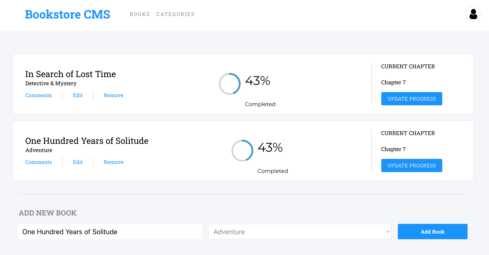

# BookStore

> The Bookstore is a website that allows the user to display a list of books using an API, add a book and remove a selected book.

## Built With
- HTML & CSS & JavaScript
- React.Js
- Redux
- Html, Css & JavaScript linters

## Live Demo 

[Live Demo Link](selmab-react-template.netlify.app)

## Getting Started

This project was bootstrapped with [Create React App](https://github.com/facebook/create-react-app).

- clone the repository by running\
    `git clone https://github.com/selma-belhadj/Bookstore.git`
- navigate to the folder\
    `cd Bookstore`
- Install packages\
    `npm install`
- Run the app\
    `npm start`
- Eject the app\
    `npm run eject`
- Create build app\
    `npm run build`
- Test Linters app\
    `npm run check-linters`

## Authors

👤 **Selma Belhadj**

- GitHub: [@selma-belhadj](https://github.com/selma-belhadj)
- Twitter: [@Bel_Selma16](https://twitter.com/Bel_Selma16)
- LinkedIn: [@selma-belhadj](https://www.linkedin.com/in/selma-belhadj/)

## 🤝 Contributing

Contributions, issues, and feature requests are welcome!

Feel free to check the [issues page](../../issues/).

## Show your support

Give a ⭐️ if you like this project!

## 📝  License
This project is [MIT](./MIT.md) licensed.
